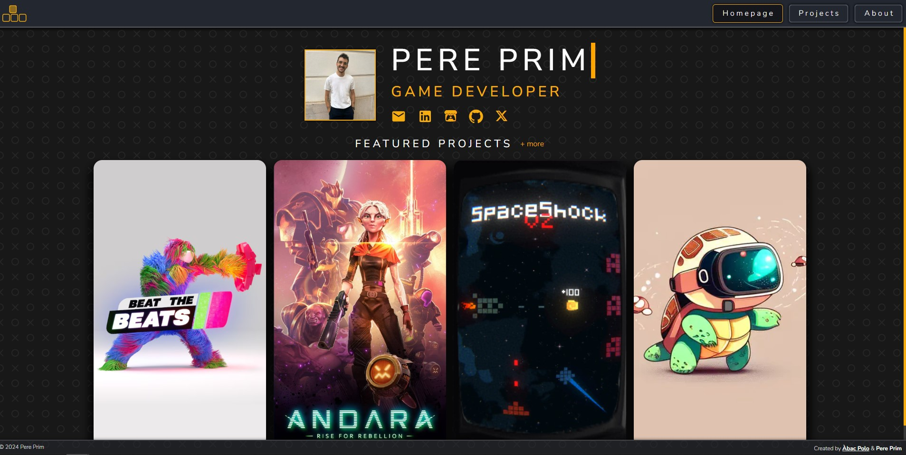
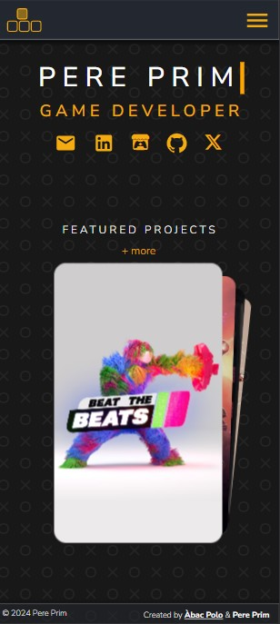

# $\color{orange}{\text{ Pere Prim - Game Developer }}$

## Web Preview - Desktop

## Web Preview - Mobile

-----------------------
## To Start Web
In the base directory
1. npm install
2. npm start

In the Sanity directory (pere-prm)
1. npm install
2. sanity start
3. sanity build

To Publish the sanity changes
1. sanity login (if you are not logged)
2. sanity deploy

-----------------------
## To Deploy Web
1. npm run deploy

